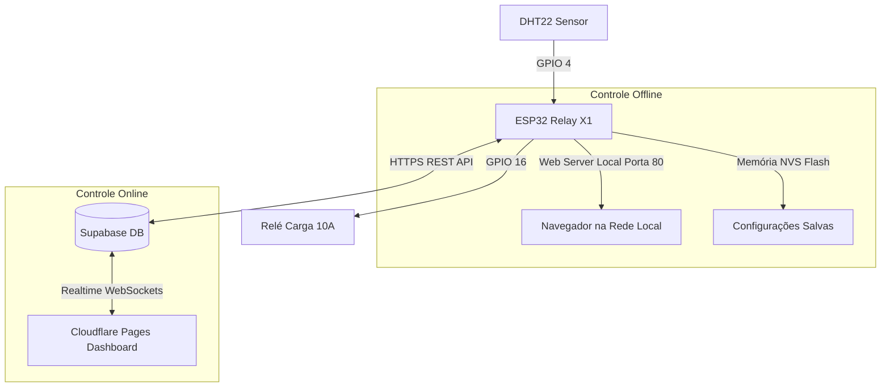

# 🌡️ Termostato Digital Web (ESP32 Relay X1 + DHT22 + Supabase + Cloudflare Pages)

Sistema completo de controle de temperatura e umidade com funcionamento **Dual Mode (100% Offline e Online)**.

---

## 🚀 Arquitetura do Sistema

---

## 🔌 1. Esquema de Ligação do Hardware

### Placa **ESP32_RELAY X1_V1.2**:
- **Sensor DHT22**:
  - **VCC (Pino 1)**: Conectar ao pino **3V3** (ou 5V) da placa.
  - **DATA (Pino 2)**: Conectar ao pino **GPIO 4** da placa.
  - **NC (Pino 3)**: Não conectado.
  - **GND (Pino 4)**: Conectar ao **GND** da placa.
- **Relé**: Mapeado internamente no **GPIO 16** (aciona o borne COM/NO).

---

## 🗄️ 2. Configuração do Banco de Dados (Supabase)

1. Acesse o painel do seu projeto no [Supabase](https://supabase.com/).
2. No menu lateral, clique em **SQL Editor**.
3. Copie e cole todo o conteúdo do arquivo [`supabase/schema.sql`](file:///C:/Users/Lucas/Downloads/TERMOSTATO-DIGITAL-WEB-main/TERMOSTATO-DIGITAL-WEB-main/supabase/schema.sql) e clique em **Run**.
4. Em **Project Settings > API**, copie:
   - **Project URL** (Ex: `https://xxxx.supabase.co`)
   - **Project API Keys -> `anon` `public`**

---

## 💻 3. Firmware ESP32 (PlatformIO no VS Code)

1. Abra o VS Code com a extensão **PlatformIO IDE** instalada.
2. Abra a pasta [`firmware`](file:///C:/Users/Lucas/Downloads/TERMOSTATO-DIGITAL-WEB-main/TERMOSTATO-DIGITAL-WEB-main/firmware).
3. Abra o arquivo [`firmware/include/config.h`](file:///C:/Users/Lucas/Downloads/TERMOSTATO-DIGITAL-WEB-main/TERMOSTATO-DIGITAL-WEB-main/firmware/include/config.h) e preencha:
   - Seu **Wi-Fi** e **Senha**.
   - Sua **Supabase URL** e **Anon Key**.
4. Conecte a placa ESP32 no cabo USB e clique no botão **Upload** (ícone de seta `->` no PlatformIO).
5. Abra o **Serial Monitor** (115200 baud) para verificar o IP atribuído ao ESP32.

---

## 🌐 4. Deploy no Cloudflare Pages (Frontend Web)

1. Acesse o [Cloudflare Dashboard](https://dash.cloudflare.com/) > **Workers & Pages**.
2. Clique em **Create application** > **Pages** > **Upload assets**.
3. Arraste a pasta [`frontend`](file:///C:/Users/Lucas/Downloads/TERMOSTATO-DIGITAL-WEB-main/TERMOSTATO-DIGITAL-WEB-main/frontend) para o Cloudflare Pages e clique em **Deploy Site**.
4. Abra o link gerado, clique no ícone de engrenagem ⚙️ e insira a **URL** e a **Anon Key** do Supabase!

Pronto! Seu termostato digital já está sincronizado em tempo real na nuvem e com autonomia offline garantida.
